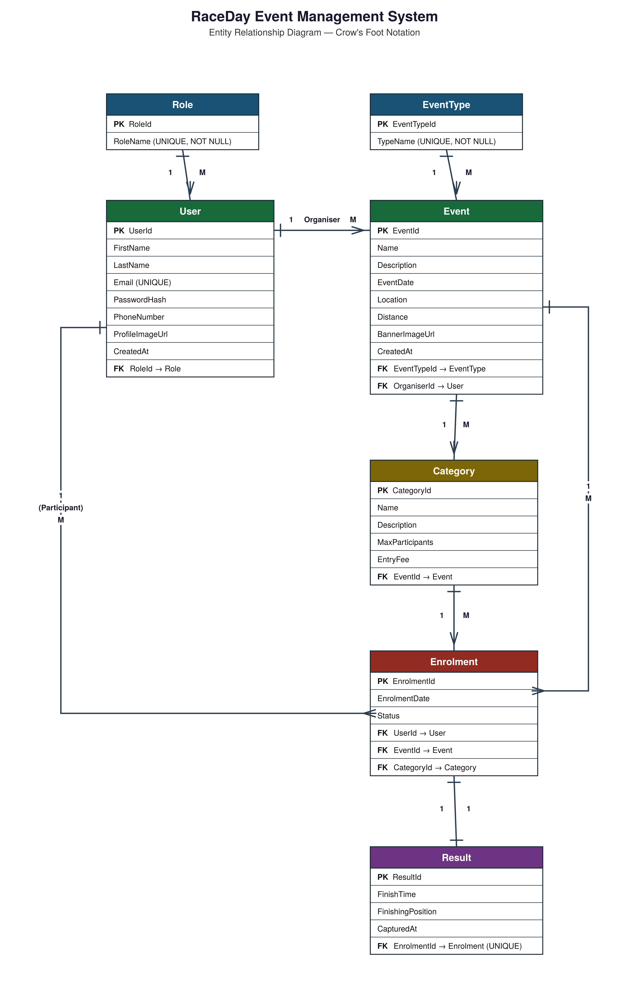
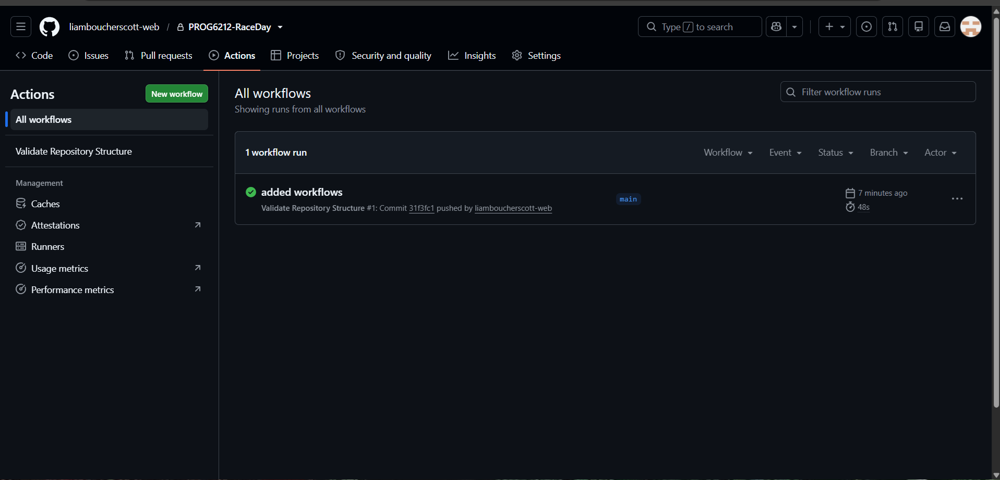

\# RaceDay — Event Management System

\*\*Module:\*\* PROG6212 - Programming 2B

\*\*Student Number:\*\* ST10467183

\*\*Student Name:\*\* Liam Scott

\## Overview

RaceDay is a full-stack event management platform for the South African

road running, walking, and cycling community. It connects Event Organisers

with Participants, allowing organisers to create and manage events,

categories, and results, while participants browse events, enrol, and

track their personal performance history.

\## Roles

\- \*\*Organiser\*\* — creates and manages events, categories, and captures results

\- \*\*Participant\*\* — browses events, enrols, and views personal results

\## Repository Structure

\- `/docs` — ERD, API endpoint plan, SQL database script

\- `.github/workflows` — CI/CD validation workflow

\## Part 1 — System Planning

See `/docs` for:

\- `ERD.png` — Entity Relationship Diagram

\- `api-endpoint-plan.md` — Full API endpoint specification

\- `RaceDayDB.sql` — SQL Server database script

\## Setup Instructions

1\. Clone the repository

2\. Open `docs/RaceDayDB.sql` in SQL Server Management Studio

3\. Run the script against a clean SQL Server instance

---

## Entity Relationship Diagram

---

## CI/CD Status

### Note on CI/CD

GitHub Actions is disabled at the organization level (EMGPPT policy).
The workflow file at `.github/workflows/validate-docs.yml` is fully
configured to validate the `/docs` folder and required files.

A mirror of this repository is available at
[https://github.com/liamboucherscott-web/PROG6212-RaceDay](https://github.com/liamboucherscott-web/PROG6212-RaceDay)
where the workflow runs successfully (see screenshot above).

